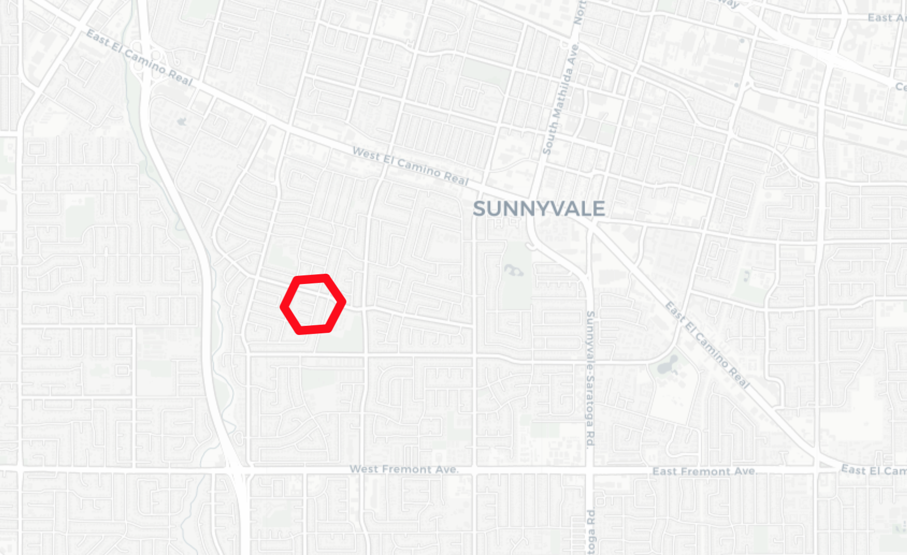
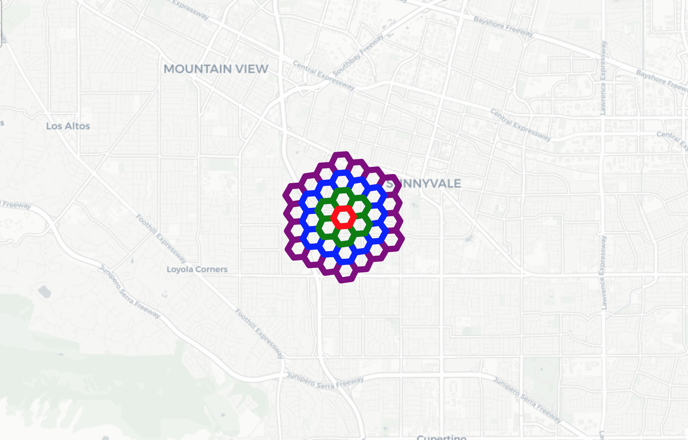

H3-Python
=========

|Build Status| |H3 Version| |License|

This library provides Python bindings for the `H3 Core
Library <https://github.com/uber/h3>`__. For API reference, please see
the `H3 Documentation <https://uber.github.io/h3/>`__.

Installing
==========

IMPORTANT: The `h3` library currently requires **Python 3.5** or later.

You need to have ``cc``, ``make``, and ``cmake`` in your ``$PATH`` when installing this
package:

.. code:: sh

    which cc
    /usr/bin/cc
    which make
    /usr/bin/make
    which cmake
    /usr/bin/cmake

**Python 2.7+:**

.. code:: sh

    pip install h3

Development
===========

.. code:: sh

    git clone https://github.com/uber/h3-py.git && cd h3-py
    virtualenv env 
    source env/bin/activate
    pip install -r requirements-dev.txt
    fab bootstrap

Usage
=====

The following visualizations are achieved with
`folium <https://github.com/python-visualization/folium>`__.

.. code:: python

    from h3 import h3

Convert lat/lng to hexagon address
~~~~~~~~~~~~~~~~~~~~~~~~~~~~~~~~~~

.. code:: python

    h3_address = h3.geo_to_h3(37.3615593, -122.0553238, 5) # lat, lng, hex resolution
    hex_center_coordinates = h3.h3_to_geo(h3_address) # array of [lat, lng]
    hex_boundary = h3.h3_to_geo_boundary(h3_address) # array of arrays of [lat, lng]

    
Get KRings of hexagon
~~~~~~~~~~~~~~~~~~~~~

.. code:: python

    h3.k_ring_distances(h3_address, 4) # array of 4 rings with size [1, 6, 12, 18]
    h3.k_ring(h3_address, 4) # a collection of hexagons within kring sizes from 0 to 3

 
Polyfill a Geo Json with hexagons
~~~~~~~~~~~~~~~~~~~~~~~~~~~~~~~~~

.. code:: python

    geoJson = {'type': 'Polygon',
     'coordinates': [[[37.813318999983238, -122.4089866999972145], 
     [ 37.7866302000007224, -122.3805436999997056 ], 
     [37.7198061999978478, -122.3544736999993603], 
     [ 37.7076131999975672, -122.5123436999983966 ], 
     [37.7835871999971715, -122.5247187000021967],  
     [37.8151571999998453, -122.4798767000009008]]] }
    hexagons = list(h3.polyfill(geoJson, 8)) # resolution 8

.. image:: docs/source/Polyfill.png
	   :scale: 50%

    
For more API reference, please see the `H3
Documentation <https://uber.github.io/h3/>`__.

.. |Build Status| image:: https://travis-ci.org/uber/h3-py.svg?branch=master
   :target: https://travis-ci.org/uber/h3-py
.. |H3 Version| image:: https://img.shields.io/badge/h3-v3.1.0-blue.svg
   :target: https://github.com/uber/h3/releases/tag/v3.1.0
.. |License| image:: https://img.shields.io/badge/License-Apache%202.0-blue.svg
   :target: LICENSE
